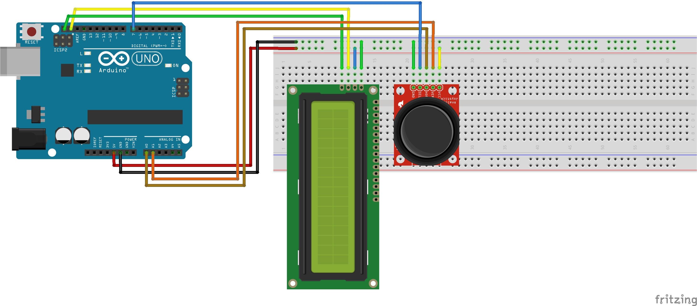

# Arduino Tic-Tac-Toe Game with Joystick and LCD

This project is a simple Tic-Tac-Toe game implemented on an Arduino with a joystick input and a 16x2 LCD display.

## Schematic

### Components:
- Arduino Uno
- 16x2 LCD Display
- Analog Joystick
- Push Button for Reset
- Connecting Wires

### Wiring:
- **Joystick:**
  - VCC to 5V on Arduino
  - GND to GND on Arduino
  - VRx to A0 on Arduino
  - VRy to A1 on Arduino
  - SW to digital pin 7 on Arduino
- **LCD:**
  - RS to 12
  - EN to 11
  - D4 to 5
  - D5 to 4
  - D6 to 3
  - D7 to 2
  - VSS to GND
  - VDD to 5V
  - V0 to a potentiometer
  - RW to GND
  - K to GND
  - A to 5V through a resistor
- **Reset Button:**
  - One side to GND
  - Other side to digital pin 8 with a pull-up resistor

### How to Play
- Use the joystick to navigate and select cells.
- Press the joystick button to place your marker.
- Press the reset button to restart the game.

### Code
[View the Arduino code](https://github.com/Fish49/Arduino-Projects)
